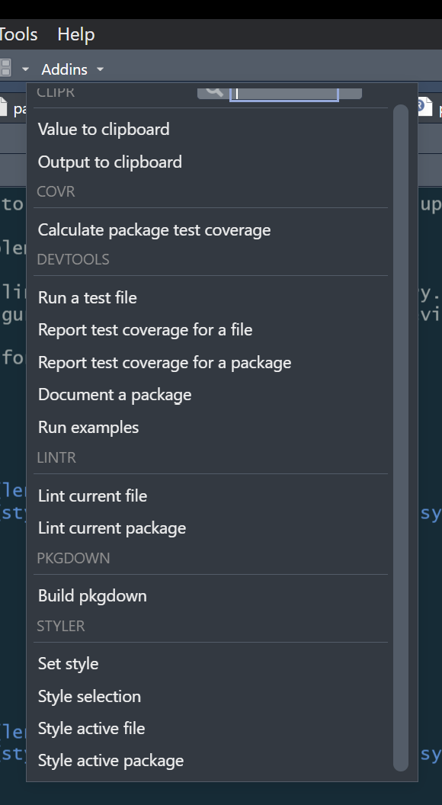

Thank you for your interest in contributing to the PACE-HRH project!

## Pull Requests

TBD

## Raising Issues

TBD

## Code Style

The PACE-HRH project follows [the tidyverse style guide](https://style.tidyverse.org/), with the following exceptions:

#### Names of variables, objects, functions, and function parameters

PACE-HRH uses a variation of camel case (e.g. variableName or ObjectName) for names. PACE-HRH code does not use snake case (variable_name) or dotted case (variable.name)

* Public functions and objects (public names that would appear in the package reference and be visible to the pacehrh:: operator) use camel case with an upper case first letter. Example: `CheckInputExcelFileFormat()`

* Internal functions use camel case with a lower case first letter. Example: `loadTable()`

* Function parameters use camel case with a lower case first letter. Example: `.getMinMaxRates <- function(initRates, limits) { ... }`

* Internal functions intended to be scoped to one source file may have a leading period: Example: `.getRatesLimits()` 

_Note: R doesn't actually support private scoping, but we follow this "leading dot" convention to give a hint to a function's intended scope. These "private" functions will still be visible to anybody using the pacehrh::: operator._

* If you have free reign, treat data labels (for example, data frame column names) like any other variable and use camel case with a lower case first letter.

_Note: Data labels are often inherited from an external data source, and it can make more sense to follow the data provider's convention than impose a new one. If you're using R's famous built-in iris dataset, readers of your code may already be familiar with the column names: Sepal.Length, Sepal.Width, etc. Your code will be easier for them to understand if you stick with these names, even though they don't match the PACE-HRH code style standard. For another example, DHS datasets can have scores of fields, with ugly names like v008, v011, v005, midx, m3h-j, etc. You might be tempted to substitute more descriptive names, but be aware that the original labels are used in many places, such as [Guide to DHS Statistics](https://dhsprogram.com/pubs/pdf/DHSG1/Guide_to_DHS_Statistics_DHS-7_v2.pdf)._

#### Line lengths

The PACE-HRH style allows for 120-character lines (instead of the tidyverse default of 80).

#### Object name lengths

The PACE-HRH style allows for 40-character object names (instead of the tidyverse default of 30).

#### return() statements

The tidyverse style guide recommends avoiding return() statements at the end of functions, relying instead on R's native behavior of returning the value of the last evaluated expression. We prefer using return() even at the end of functions because it makes the behavior of the code more explicit, especially for less experienced readers of the code. 

### Using styler and lintr

The R packages [styler](https://styler.r-lib.org/) and [lintr](https://lintr.r-lib.org/) are the core tools for managing code style. We recommend installing both to your RStudio IDE.

The __styler__ package re-formats code according to whatever style rules have been set up.

The __lintr__ package checks for code style problems. 

The linting configuration is controlled by the .lint file in the package root directory.

With the .lintr file in place, the command to lint a file is:

```
lint("<r-source-code-file-path>")
```

For example:

```
lint("R/pace_rates_matrix.R")
```

This longer form of the lint() command duplicates the configuration set by the .lint file:

```
lint(
  "<r-source-code-file-path>",
  linters = linters_with_defaults(
    line_length_linter = line_length_linter(length = 120L),
    object_length_linter(length = 40L),
    object_name_linter = object_name_linter(styles = c("camelCase", "CamelCase", "symbols"))
  )
)
```

The following lintr:: command checks the entire R source directory.

```
lintr::lint_dir("./R")
```

Like __styler__, the RStudio _Code/Reformat Code_ command modifies code to bring it close to the tidyverse standard. Once installed, __styler__ has the advantage that both __styler__ and __lintr__ install commands into the RStudio _Addins_ list.



### Disabling linting

A well-known linting annoyance is the "no visible binding for global variable 'variableName'" message that presents when __ggplot__ and __data.table__ are used in standard ways. These packages implement simple and expressive function call syntax by taking advantage of R's meta-programming features, but linters don't know that and raise a warning. The recommended remedy is to disable linting for those blocks of code. (Disabling the object_usage_linter is a bad idea because other useful checks would also be turned off.)

__lintr__ supports code comment macros to disable linting for blocks of code. In the following example, "no visible binding for global variable 'variableName'" warnings would be generated by the object labels Year, CadreMember, Category and Indicator. __data.table__ understands them as column names, but the object_usage_linter() doesn't know that and thinks they're undeclared variables ("no visible binding" is R-speak for "unknown variable").

```
  # nolint start

  tokens <- data.table::tstrsplit(dt[, Category], tokenSeparator)
  dt[, Year := as.numeric(tokens[[1]])]
  dt[, CadreMember := tokens[[2]]]

  # Remove unnecessary columns
  dt <- dt[CadreMember != "Total"]
  dt <- dt[CadreMember != "Unassigned"]

  dt <-
    data.table::dcast(
      dt,
      Indicator + Year ~ CadreMember,
      value.var = "allocation",
      fill = 0
    )

  # nolint end
```
