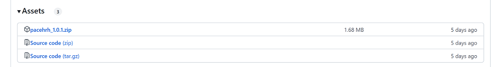

```{r setup, include=FALSE}
knitr::opts_chunk$set(echo = TRUE)
```

# Get started with the PACE-HRH model 

The PACE-HRH model simulates healthcare needs in a given population to enable
better health system staffing decisions. PACE-HRH is a stochastic, Monte
Carlo simulation model, meaning that the population, its healthcare needs,
and the time required to meet those are simulated and there is randomness
built into the model uncertainty in the population's size, growth, and
healthcare needs. The model is configured via Excel sheets and run via an R
script. 

## Install the model

Generally, we recommend installing the current released version of the Windows
binary, which has been tested and documented. You can also install directly
from unreleased source code in GitHub, which may be useful if you are
modifying the model code or need the latest fixes that have not been released
officially. 

<!--- Can this only be run on Windows? Do we have alternate directions for Mac or Linux OS?--->

### Install using the current released version Windows binaries 

Follow the instructions below to install a tested, released version of the model.

1.  Download the latest binary zip file from https://github.com/InstituteforDiseaseModeling/PACE-HRH/releases.
    This will be the first file listed under **Assets**. 
    
2.  Open RStudio and, from the **Tools** menu, select **Install Packages ...**.
3.  Under **Install from:**, select the most recent version of the PACE-HRH package binary zip file that you downloaded. 
4.  Select the installation location and then click **Install**. 
5.  You may see a banner at the top of the screen that indicates some dependent packages that are 
    required. Select **Yes**. to enable installation.
    
### Install development version or custom version via GitHub

Alternatively, you can install from repository source code with the desired git
reference, which could be a commit, tag, or branch name. By default, the main
branch has the most up-to-date code. 

If you need to get the latest fixes from main which have not yet been released
officially, you can run the following code in RStudio:

```{r, eval=FALSE, echo=TRUE}
devtools::install_github("InstituteforDiseaseModeling/PACE-HRH", subdir="pacehrh")
```    
If your analysis is based on an older version or a custom branch, you can run the following:
```{r, eval=FALSE, echo=TRUE}
# Use commit hash
devtools::install_github("InstituteforDiseaseModeling/PACE-HRH", subdir="pacehrh", ref="d2ccdd2")
# Use custom branch
devtools::install_github("InstituteforDiseaseModeling/PACE-HRH", subdir="pacehrh", ref="my_branch")
```    

## Run model simulations

By default, the model is configured with values from Ethiopian data. To run
simulations using the default data, follow the instructions below. To run
simulations using your own data for a different context, first edit the
config/model_inputs.xlsx file as described in the "Configure the model"
section below. 

1.  In RStudio, open the "Run simulations.R" script. 
2.  In the R code, set *numtrials* to the number of simulations you want to run. 100 tends to be good; 
    higher values can take longer because of the stochasticity in the model.
3.  Run the script. 
    The results are saved out to a CSV file with the date and name of the geography as specified
    in Excel in the filename. The console will beep at you when the model has finished running. 

## Configure the model

To configure the model, you input data in Excel spreadsheets that describe the population's
demographics, healthcare tasks, and available staff in the geographic region of interest. To begin,
navigate to the "config" directory and open the Excel workbook "model_inputs.xlsx".

The workbook is initially configured to model a simple set of tasks and
contains example values from Ethiopia. You should edit the workbook parameters for the
particular context you are working in. 

The sections below describe each of the spreadsheets that are used as model inputs. You will see
each of these sheets in tabs across the bottom of the Excel workbook.

### Scenarios

The **Scenarios** sheet is the primary sheet that controls inputs to the model. Every row is a separate scenario and  lists the different healthcare scenarios that you'd like to model. You may vary parameters in each scenario to compare different proposed healthcare staffing options by changing the relevant values or the tab specified to be used. For example, the default values hold the demographic and seasonality parameters consistent across scenarios but vary the healthcare tasks and staffing cadres to model proposed health system policies.

#### Parameters

* **UniqueID**: The name of the scenario to model. The name must be unique and will be used to name the results output files after the simulation runs. This can be any useful description, but should not include special characters. 
* **WeeksPerYr**: The number of working weeks in the year, excluding time off and absenteeism. For example, if a typical worker has 2 weeks of vacation and is absent 3 weeks per year, then this value would be 52-2-3=47.
* **HrsPerWeek**: The number of hours each week a typical healthcare worker is expected to work, excluding breaks and on-call time. This should typically be less than 40.
* **BaselinePop**: The number of people in a typical healthcare catchment. Usually, these values are
  set as targets by a government healthcare program, such as the size of the population each
  primary healthcare facility is expected to serve. Value typically range from 5,000 to 20,000.
* **o_PopGrowth** Typically this should be set to TRUE. Optionally, this true/false binary value turns on or off the growth of the population. If set to TRUE, the population size will grow at a rate dependent on the fertility and mortality (set elsewhere). If set to FALSE, the population pyramid will evolve per the fertility and mortality, but the total population will be normalized to the **BaselinePop** value every year, stabilizing population size. This is to be used for debugging and sensitivity analysis.
* **o_Fertility_decr** Typically this should be set to TRUE. Optionally, this true/false binary value turns on or off the annual change in the fertility rate. If set to TRUE, fertility rates will decline over time (set elsewhere). If set to FALSE, fertility will remain stable at the level set for the first year of the simulation. This is to be used for debugging and sensitivity analysis.
* **o_MHIVTB_decr** Typically this should be set to TRUE. Optionally, this true/false binary value turns on or off the annual change (as specified by the delta) in the incidence rates for malaria, HIV, and TB. If set to TRUE, incidence rates will decline over time (set elsewhere). If set to FALSE, these rates will remain stable at the level set for the first year of the simulation. For a task that has a **AnnualDeltaRatio** of exactly 1.0, this option will not have any effect. This is to be used for debugging and sensitivity analysis.
* **o_ChildDis_decr** Typically this should be set to TRUE. Optionally, this true/false binary value turns on or off the annual change (as specified by the delta) in the incidence rates for childhood disease tasks. These are defined within the model as any tasks that are applied to the age 1-4 population, as specified in the population column on the **Task Values** sheet. It does not include those that are specific to a subset (e.g., 1 yo). If set to TRUE, incidence rates will decline over time (set elsewhere). If set to FALSE, these rates will remain stable at the level set for the first year of the simulation. For a task that has a **AnnualDeltaRatio** of exactly 1.0, this option will not have any effect. This is to be used for debugging and sensitivity analysis.
* **sheet_** columns I through M: The name of the sheets to use as inputs for **TaskValues**, 
  **PopValues**, **SeasonalityCurves**, **TaskAllocByCadre**, and **Coverage** in the model. The function and format of each of those sheets is described in more detail below.
* **DeliveryModel**: A text description for the healthcare delivery model scenario. This is for user reference only and does not change how the model functions.
* **Geography_dontedit**: Informational field that is populated by the **RegionSelect** sheet. Do not edit here, as it will not affect the functioning of the model but is automatically used for naming the results files and may result in confusion if it is changed manually.

### RegionSelect

The **RegionSelect** sheet specifies the geographic region to be simulated. 

#### Parameters

* **adminNameAsUsed**: The human-readable name for each administrative unit. You may include 
  units at different levels, for example an entire country and also the administrative 
  districts within that country. Provide the values in column F, which will populate the drop-down 
  menu in column B. The selection you make in column B will populate to the relevant population, fertility, mortality, and incidence rates are updated throughout the workbook.
* **adminCode**: The unique numerical code for the administrative district. Provide the values in
  column G. Selecting from the drop-down menu in column B will populate the **adminCode** in column C. 

### TotalPop

The **TotalPop** sheet lists the number of people (male, female, and total) in each annual age bin, 
from 0 to 100. Optionally, multiple **TotalPop** tabs can be created and referenced in the **Scenarios** tab.

### StochasticParameters

The **StochasticParameters** sheet lists the **p** and **q** values that determine the width of the 
stochastic distributions around various parameter values. See the table below for more detail.

| Value                                              | Distribution             | Value inputs     | Parameters                                       |
|:-------------------------------------------------- |:-------------------------|:-----------------|:-------------------------------------------------|
| Fertility rates                                               | Uniform                  | mean, p          | $$min = mean - mean*p$$ $$max = mean + mean*p$$ |
| Mortality rates                                               | Uniform                  | mean, p          | $$min = mean - mean*p$$ $$max = mean + mean*p$$ |
| Incidence rates <br />(**TaskValues** column H)               | Uniform                  | mean, p          | $$min = mean - mean*p$$ $$max = mean + mean*p$$ |
| Annual delta fertility rates                                  | Truncated normal*        | delta, p, q      | $$mean = delta$$ $$std.dev. = p$$ $$a = mean - p*q$$ $$b = mean + p*q$$  |
| Annual delta mortality rates                                  | Truncated normal*        | delta, p, q      | $$mean = delta$$ $$std.dev. = p$$ $$a = mean - p*q$$ $$b = mean + p*q$$ | 
| Annual delta incidence rates <br />(**TaskValues** column L)  | Truncated normal*        | delta, p, q      | $$mean = delta$$ $$std.dev. = p$$ $$a = mean - p*q$$ $$b = mean + p*q$$ |
| Seasonality ratio to mean                                     | Uniform                  | mean, p          | $$min = mean - mean*p$$ $$max = mean + mean*p$$ |
| Minutes per contact <br />(optional; **TaskValues** column O) | Lognormal                | mean, p          | $$sdlog = \sqrt{log(1 + (\frac{p}{mean})^2)}$$ $$meanlog = log(mean)-\frac{log(1 + (\frac{p}{mean})^2)}{2}$$ |
| Hours per week <br />(optional; **TaskValues** column P)      | Uniform                  | mean, p          | $$min = mean - mean*p$$ $$max = mean + mean*p$$ |     

\* Truncated normal can be done in R using the truncnorm package.  

We are approximating a Markov random walk with drift. The error term is generally modeled with a normal 
distribution, plus an additional drift distribution. Here we use just one parameter. There is some 
evidence that a Weibull distribution is also a good option. 

### PopValues

The **PopValues** sheet contains fertility and mortality rates for different groups in the
population. Fertility rates are specified as births per woman per year and will add people to the
simulated population. Mortality rates are specified per individual per year and will remove people.
All rates (and rates of change) in the model are stochastic; the value you specify is the mean in a distribution and the variance is determined by the 'p' and 'q' parameters set on the **StochasticParameters** tab.  The first row, "Annual birth rate male," is the fertility rate applied to males (so it should always be set to zero); this is necessary for running the model.

Columns A through F define standard categories and shouldn't need to be modified unless you plan to
add functionality to the model itself. Default values are sourced from Ethiopian DHS data but
should be changed for your context. If you look at the equation in each cell, you can see that the
data is being sourced from another sheet in the workbook. However, the **PopValues** sheet is the
one used as an input to the model, so values can be changed directly here if you prefer. 

#### Parameters

* **Description**: The human-readable demographics category. This does not affect the model's functionality and is for readability only.
* **Label**: The unique string that defines that category.
* **Type**: The type of rate describes, mortality or fertility.
* **Sex**: The sex to which the rate applies.
* **BandStart**: The youngest age to which the rate applies.
* **BandEnd**: The oldest age to which the rate applies. Note: Be sure that the population age bands do not overlap, or multiple rates will be applied to the same people.
* **InitValue**: The rate value at the beginning of the simulation.
* **ChangeRate**: The annual change in rate over the course of the simulation. A value of 1 
  indicates no change, a value above 1 indicates the rate is increasing over time, and a value
  below 1 indicates the rate is decreasing. For example, the age 15-19 initial fertility rate of 0.072 will be 0.0712 (0.72 * 0.988469278) after one year.
* **ValueCode**: The unique string identifying the category. These are useful when analyzing model 
  outputs. 

### ChangeRateLimits

The **ChangeRateLimits** sheet sets limits on cumulative rate of change applied to the mortality, fertility, and incidence rates over the course of the simulation. These limits restrain the predicted values of the rates inside the range considered reasonable by the user. For example, if the user believes that over the course of the simulation, the fertility rates should never decline to 50% of the starting level, the user should set a lower limit of 0.5 for the fertility rates category. The user has the flexibility to set either one or both of upper and lower limits. 

#### Parameters

* **RateCategory**: Category of the rates that the upper and lower limits can be applied to. Applicable rate categories include **Mortality**, **Fertility**, and **Incidence**. This column shouldn't be modified unless you plan to add functionality to the model itself.
* **Min**: The lower limit of permissible cumulative change in rates, expressed as a ratio to the rate values at the beginning of the simulation. **Min** must be greater than 0. For example, with a **Min** value of 0.6 set for the rate category "Mortality", the initial mortality rates are multiplied by 0.6 to establish lower limits for predicted mortality rates over the course of the simulation. Any predicted mortality rates below these lower limits would be replaced by the lower limits by the model. If **Min** is left empty for any **RateCategory**, the model would run without imposing a lower limit on cumulative change for this **RateCategory**.
* **Max**: The upper limit of permissible cumulative change in rates, expressed as a ratio to the rate values at the beginning of the simulation. **Max** must be greater than 0. For example, with a **Max** value of 1.1 set for the rate category "Mortality", the initial mortality rates are multiplied by 1.1 to establish upper limits for predicted mortality rates over the course of the simulation. Any predicted mortality rates above these upper limits would be replaced by the upper limits by the model. If **Max** is left empty for any **RateCategory**, the model would run without imposing an upper limit on cumulative change for this **RateCategory**.For each **RateCategory**, the value set for **Max** must be greater than or equal to the value set for **Min**.

### TaskValues

The **TaskValues** sheets describe the specific healthcare tasks that are completed by the
healthcare workers. The model provides a reference sheet (**TaskValues_ref**) that lists a
comprehensive range of healthcare tasks, such as vaccination, education about contraceptives,
antenatal care, etc. You can down-select the tasks included in your model by deleting rows on the reference sheet and all other **TaskValues** sheets.

You can then provide one or more **TaskValues** sheets that describe who receives and performs the
healthcare tasks, how often, and for how long. These sheets are specified as inputs to the model
via the **Scenarios** sheet. For example, by default there are three **TaskValues**
sheets: **TV_Basic** and **TV_Comprehensive**. These are quite similar, but have
different subsets of tasks listed, to differentiate different delivery model scenarios. You can
set these sheets up to include whichever sets of healthcare services you are delivering in the
scenarios you want to model. You could also have different healthcare services available for
different regions, which would require the creation of additional **TV_** tabs.

Columns A through D are only for reference from the original data source and are not used as inputs
to the model. Columns G through I do not affect the running of the model, but are used in the automatic creation of summary statistics and can be used for manually post-processing the results. Columns L through P jointly determine how many resources are required for a given task by specifying how many contacts with the healthcare system are required for a given task, how long each contact takes, and the number of proportion of people that received care. 

#### Parameters

* **Indicator**: A unique ID. For example, the indicator FH.MN.ANC.1 indicates Family Health, Maternal and Newborn, Antenatal, and first task. These can be set to any useful text (excluding special characters), but each row must be a unique value.
* **CommonName**: The human-readable common name for the task.
* **ClinicalOrNon**: Indicates if the task is clinical, non-clinical, or non-productive.
* **ClinicalCat**: The sub-category for the task. These can be any text value that is useful.
* **ServiceCat**: The sub-sub-category for the task. These can be any text value that is useful.
* **RelevantPop**: The population to which this healthcare task applies, selected via a drop-down 
  menu. For example, antenatal care is proportional to the number of births. Cervical cancer care is proportional to the population of women of child-bearing age. This value changes which population the task is applied to in the model. Additional populations cannot be specified via the **R Model Inputs** file.
* **Geography**: Automatically filled based on the region specified in the **RegionSelect** sheet. Do not change this column manually.
* **StartingRateInPop**: The proportion of the relevant population that receives this care. For
  example, the value for antenatal care visits is 1 because every new birth requires that care. This value should never exceed 1.0. If a task occurs multiple times for a single individual, that should be incorporated in either the **NumContactsPerUnit** or in the **RateMultiplier** as appropriate.
* **RateMultiplier**: A multiplier to account for tasks that happen in excess of the number of 
  people in the eligible population. For example, you would use HIV incidence rate as the 
  **StartingRateInPop** for HIV testing, but some proportion of the people that receive tests do 
  not have HIV. The proportion of true negatives will be the **RateMultiplier** such that the 
  **StartingRateInPop** * **RateMultiplier** is equal to the number of people who receive testing.
* **AnnualDeltaRatio**: The annual change in the proportion of the relevant population who receives
  care. For diseases declining in prevalence, this should be below less than 1.0 (e.g. childhood parasites). For diseases increasing in prevalence, this should be greater than 1.0. A value of exactly 1.0 tells the model that the incidence rate is fixed and the model uses the **StartingRateInPop** perpetually every year, without applying a stochastic annual change to the rate.
* **NumContactsPerUnit**: The number of contacts with the healthcare system per person who is 
  eligible to receive this task. In the default example, four antenatal care visits per birth are
  recommended.
* **NumContactsAnnual**: The number of contacts with the healthcare system per person annually for
  this task. Used for routine preventative care that happens on an annual schedule and isn't based
  on age or condition. Most tasks will have either a number of contacts per unit or a number of contacts annual, but not both.
* **MinsPerContact**: The number of minutes required by the healthcare worker to complete this task
  with an individual. This value should typically range between 5 and 30 minutes. 
* **HoursPerWeek**: The number of hours per week a healthcare workers spends on a task, usually a non-clinical task that is not directly related to population rates. For example, there may be a few hours of weekly administrative tasks required, regardless of clinical care provided. Community engagement, outreach, and supply management may also be tasks with this dynamic.

### CoverageRates

The **CoverageRates** sheets specify the service coverage rates for healthcare tasks from the beginning year of the simulation to the ending year of the simulation. The user has the flexibility to specify coverage rates for as many or few tasks as they prefer. Each row represents a healthcare task. Columns A and B reference the healthcare tasks as listed in **TaskValues** sheets. In columns C through W, the user enters any value between zero and one, which is used as a fixed coverage level for that task in the year indicated by the column name. The default sheet max out at 20 years, since extrapolation beyond that is a questionable choice. If a task is missing from the sheet, or the values are not filled in, the model will assume 100% coverage for that year-task combination. 

You can provide one or more **CoverageRates** sheets that describe different potential paths for coverage scale-up. These sheets are specified as inputs to the model via the **Scenarios** sheet in the column **sheet_Coverage**, so that the user can easily run coverage comparisons. For example, by default the **CoverageRates_SlowRamp** sheet is used in all three scenarios. When multiple scenarios using different **TaskValues** sheets share the same **CoverageRates** sheet like in this case, it is okay for a **TaskValues** sheet to not contain all the tasks listed in the **CoverageRates** sheet. If a task listed in a  **CoverageRates** sheet cannot be found in the **TaskValues** sheet used in the same scenario, this task will be ignored by the model. For example, "FH.MN.ANC.2" is not in **TV_Merged**, therefore the model will ignore this task when doing calculations for the **MergedModel** scenario, and will only incorporate coverage rates for the tasks the **TV_Merged** sheet contains, such as "FH.MN.ANC.1" and "FH.MN.PNC.7".

#### Parameters

* **Indicator**: Unique identifier for healthcare tasks, used to match the **Indicator** column in the **TaskValues** sheets.
* **CommonName**: The human-readable common name for the task.
* **Year ** columns C through W: Service coverage rate for the healthcare task in each year over the course of the simulation. The column name indicates the year that the coverage rates are applied to. For example, column **Year 0** contains values for task-specific coverage rates at the beginning of the simulation, and column **Year 1** contains coverage rate values applied to the first year of the simulation. The values must be between zero and one: from no coverage to 100% coverage for the task-year combination. For example, in the **CoverageRate_SlowRamp** sheet, you see the coverage rate for ANC visits starts at 50% in the beginning year of the simulation, and ends at 95% in the ending year of the 20-year simulation. If the values are not filled in, the model will assume 100% coverage for that year-task combination. 

### SeasonalityCurves

The **SeasonlityCurves** sheet describes birth seasonality and the seasonality of conditions like
malnutrition, TB, malaria, and diarrhea. Each month of the year is listed in a row and each cell in
a given column represents the proportion of those births or conditions that occur in a given month.
For example, in the demonstration curves, you can see that malnutrition is highest between September 
and January and lower the rest of the year.

The values in each column should sum to 1. If they don't sum to 1, the model will normalize the
values; however, this may be a source of unexpected behavior. If you see strange seasonal patterns,
we recommend verifying the sum of these values. 

You can add seasonality curves for additional conditions if desired by adding additional named columns. 
If you do so, you can then reference them on the **SeasonalityOffsets** tab. 

The **SeasonalityCurves** tab is referenced in the **Scenarios** manager. If you want to run scenarios with 
different seasonality curves, you can duplicate the **SeasonalityCurves** tab, modify it, and reference the different tabs in the **Scenarios** column M.

### SeasonalityOffsets

The **SeasonalityOffsets** sheet contains a list of the tasks that are affected by seasonality and
how they are offset from (occurring before or after) the seasonality curves. Offsets are
specified in months: negative values indicate the number of months prior to the event described by
the seasonal curve, positive values are after, and values of zero indicate there is no time offset
from the curve. The name of the curve listed in this sheet must match the name of the curve in
the **SeasonalityCurves** sheet.

For example, antenatal care visits are related to birth seasonality but precede those births by some
period of time. The first round of treatment for malnutrition will not have an offset from the
malnutrition seasonality curve, but followup visits occur at the 1, 2, and 3 month offsets. The
number of contacts with the healthcare system listed in the offset table should match the number of
contacts listed in the **TaskValue** sheets for that particular task. In other words, if four
antenatal care visits are recommended, four offsets should be listed in this sheet.

Up to six offset contacts can be specified in the model; additional contacts would require updates
to the model code. Note that the first year of a simulation may show unreliable results due to positive
seasonality offsets not being carried forward from the prior, unsimulated, year. For example, if you 
are simulating years 2030 through 2040, follow-up healthcare visits that take place in 2030 for 
malnutrition diagnosed in 2029 will not be included. We recommend ignoring the first simulated year
if you expect this will be a major concern. This edge effect is handled on the final year of the 
simulation by running the model forward an additional year and adjusting for negative offset tasks. 

### CadreRoles

Each scenario listed in the **Scenarios** sheet should have a staffing model detailed on the **CadreRoles** sheet. Columns **ScenarioID**, **RoleID**, **StartYear**, and **EndYear** jointly specify the staffing model for a scenario, and the same staffing model is used by **TaskAllocByCadre** sheets. Each row represents an individual healthcare worker with a unique **RoleID**, and healthcare tasks are allocated to this **RoleID** from **StartYear** to **EndYear**. Each scenario can have multiple healthcare workers. For example, in the default example, a staffing model for each of the three scenarios ("ComprehensiveMode", "BasicModel", "MergedModel") in the **Scenarios** sheet is represented in the **CadreRoles** sheet. In the "MergedModel" scenario, allocation of healthcare tasks to two health extension workers ("HEW1" & "HEW2") started in 2020. The allocation ended for "HEW1" in 2029 and for "HEW2" in 2034. **RoleID** and **StartYear** also appear on **TaskAllocByCadre** sheets, and the combination on both sheets must match.

The user should record hours healthcare workers spend on participating in meetings, receiving supervision, and  giving and receiving training in the column **OverheadHoursPerWeek**, since they should be accounted for separately from healthcare tasks listed in **TaskValues** sheets.

#### Parameters
* **ScenarioID**: The name of the scenario to model, should match the **UniqueID** column in the **Scenarios** sheet. If a scenario is not listed, allocation of healthcare tasks to healthcare workers can't be made. 
* **RoleID**: The unique identifier for each healthcare worker responsible for the healthcare tasks in each scenario, selected via a drop-down menu. This identifier must be unique in the same scenario, but can repeat across scenarios. For example, in the "MergedModel" scenario,  healthcare tasks are allocated among four healthcare workers through the course of the simulation, each healthcare worker with their own **RoleID**: two of them are health extension workers ("HEW1" & "HEW2"),  and the other two are family health professionals ("FHP1" & "FHP2").   
* **RoleDescription**: A text description for the type of healthcare worker (community health worker, nurse, doctor, etc.) Each scenario could have multiple healthcare workers with the same **RoleDescription**. This field can be useful in post-processing steps for grouping healthcare workers into cadres.
* **OverheadHoursPerWeek**: Number of hours per week a clinician is expected to perform tasks including meetings, training and supervision. 
* **StartYear**: The first year in which the **RoleID** is assigned healthcare tasks in each scenario.
* **EndYear**: The last year in which the **RoleID** is assigned healthcare tasks in each scenario. If **EndYear** is left empty, the model will use the default value of the last year of the simulation.

### TaskAllocByCadre

The **TaskAllocByCadre** sheets use the staffing models detailed in **CadreRoles** sheet and define the **RoleID** responsible for each healthcare task. You may have one or more of these sheets for the scenarios you are modeling. The **TaskAllocByCadre** sheet used for each scenario is defined in the **Scenarios**  sheet in the column **sheet_Cadre**. Each **TaskAllocByCadre** sheet is paired with the **TaskValue** sheet used in the same scenario. It's very important that every **Indicator** from the paired **TaskValue** sheet appears in the **TaskAllocByCadre** sheet because otherwise the tasks will be unassigned and thus uncounted. If you have unexpectedly low workload assigned to certain cadres of workers, this is a possible source of the error.

The numbers and names of the columns can be changed, but they must be specified in the format of two-level header comprising the first and second rows of the sheet. The first row should be in the format StartYearYYYY (e.g., StartYear2030) where YYYY represents the first year in which this allocation is made; the allocation remains in place for the remaining years unless an additional assignment is made. The second row contains **RoleID** selected via a drop-down menu. The first row and second row jointly reference the staffing model detailed in the **CadreRoles** sheet.

For example, the default Ethiopian example has some tasks being shifted from certain cadres of workers to other workers over time as staffing shifts, and each scenario models this shift in responsibilities slightly differently. In the **TaskAllocByCadre_Comprehensive** sheet, you see the ANC visits start out as being solely the responsibility of the Health Extension Workers ("HEW1" & "HEW2") and then shift entirely to a cadre of new midwife staff members ("MW") in 2025. A more complex example is the Pneumonia (ARI) tasks, which start as the responsibility of "HEW1" & "HEW2" and then gradually shift to the Health Officers ("HO"), Family Health Officer ("FHP1"), and Nurses ("RN"). 

The **Total** column isn't fed into the model, but is a visual check to be sure the staff assignments sum to 100% correctly. If the **Total** column is above or below 100%, this will result in either under-assignment or duplicative assignment of task time. If you have unexpected workload assigned to certain cadres of workers, this is a possible source of the error.

### RegionalData

The **RegionalData** sheet is the source file for all of the regional data included in other sheets
that is pulled in via VLOOKUP in Excel. For example, the **StartingRateInPop** used in
the **TaskValues** sheet comes from the source values in this sheet. If you want to retain the
multi-geography structure currently used in the model, we recommend changing the values here.
However, the model pulls from the sheets listed above, so you can also change the values directly
in those sheets.
